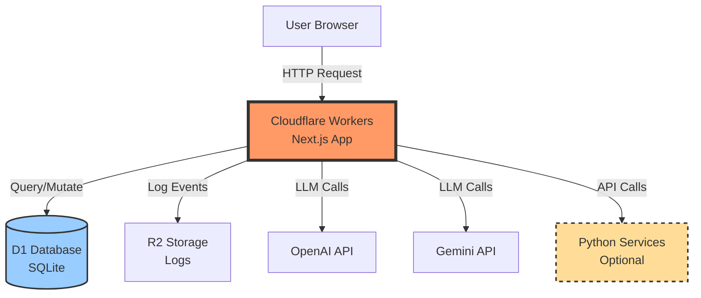

# Comprehensive PRD: Next.js Cloudflare Workers Boilerplate with D1

## Project Overview

Create a production-ready Next.js boilerplate deployable to Cloudflare Workers with SQLite (local) / D1 (production), Auth.js authentication, structured logging, and optional Python microservice integration. The boilerplate should be reusable via a CLI setup wizard.

---

## Core Technology Stack

### Primary Framework & Runtime
- **Next.js** (latest stable version, App Router)
- **Cloudflare Workers** via `@opennextjs/cloudflare` adapter
- **Node.js runtime** as default, with Edge runtime available for specific routes
- **TypeScript** (strict mode enabled)

### Database & ORM
- **SQLite** for local development
- **Cloudflare D1** for production
- **Drizzle ORM** for database operations
- **Drizzle Kit** for migrations
- Configuration must support seamless switching between SQLite (local) and D1 (production) via environment variables

### Authentication
- **Auth.js** (formerly NextAuth.js)
- Use D1-compatible adapter for session storage
- Support for email/password and OAuth providers (Google, GitHub)
- Edge-compatible configuration

### Logging
- **Structured logging** for all API calls and external service interactions
- **Cloudflare native logging** (Logpush)
- Log format: JSON with fields for:
  - Timestamp
  - Request ID
  - User ID (if authenticated)
  - Endpoint called
  - External service (OpenAI, Gemini, etc.)
  - Token count (input/output)
  - Cost estimate
  - Latency
  - Status code
  - Error details (if any)
- Export logs to R2 for analysis with Pandas notebooks

### Git Hooks (Lefthook)
Priority order:
1. **ESLint/Biome** - Code quality checks
2. **TypeScript** - Type checking
3. **Prettier/Biome** - Code formatting
4. **Conventional Commits** - Commit message linting
5. **Unit tests** - Must pass before commit

Configure pre-commit and pre-push hooks appropriately.

### Development Tools
- **Docker Compose** for local development environment
- **Wrangler** for D1 local development and deployment
- **Biome** or **ESLint + Prettier** for linting and formatting
- **Vitest** for unit testing
- **Playwright** for E2E testing (optional, basic setup)

---

## Required Features

### 1. LLM Integration with Streaming (CRITICAL - Must Work Out of Box)

**Requirement:** Provide a working example that demonstrates LLM streaming responses for smoke testing.

**Implementation Details:**
- Create example API route: `/api/chat/stream`
- Support both **OpenAI** and **Google Gemini** APIs
- Use **Vercel AI SDK** for unified streaming interface (works with Workers)
- Implement proper error handling and timeout management
- Include UI component that displays streaming responses in real-time
- Configuration via environment variables:
  ```
  OPENAI_API_KEY=sk-...
  GEMINI_API_KEY=...
  DEFAULT_LLM_PROVIDER=openai # or gemini
  ```

**Example API Route Structure:**
```typescript
// app/api/chat/stream/route.ts
export const runtime = 'edge'; // Use Edge runtime for streaming

// Should support:
// - Streaming text responses
// - Token counting
// - Cost tracking (log to structured logger)
// - Error handling with graceful fallbacks
// - Cancellation support
```

**UI Component:**
- Page at `/examples/chat` demonstrating the streaming UI
- Show token count and estimated cost in real-time
- Clear, copy, and regenerate functionality

### 2. Cost Tracking Middleware

**Requirement:** Middleware that automatically tracks and logs costs for all LLM API calls.

**Features:**
- Intercept all LLM API calls
- Calculate costs based on token usage and provider pricing
- Log to structured logger with:
  - Provider (OpenAI, Gemini, etc.)
  - Model used
  - Input tokens
  - Output tokens
  - Estimated cost in USD
  - Request timestamp
  - User ID (if authenticated)
  - Request ID for tracing
- Provide utility functions for cost estimation before making calls
- Include a `/api/usage/summary` endpoint that queries logs for cost analysis

**Token Counting:**
- Use `tiktoken` for OpenAI
- Use appropriate tokenizer for Gemini
- Cache tokenizer instances for performance

### 3. Database CRUD Example (Server-Side Rendered Counter)

**Requirement:** Simple counter example that demonstrates D1/SQLite operations with server-side rendering.

**Implementation:**
- Create a `counters` table with Drizzle schema:
  ```typescript
  // schema/counters.ts
  {
    id: integer (primary key),
    name: text,
    value: integer,
    updatedAt: timestamp
  }
  ```
- Page at `/examples/counter` that:
  - Displays current counter value (server-side rendered)
  - Has increment/decrement buttons (Server Actions)
  - Shows last updated timestamp
  - Works with both SQLite (local) and D1 (production)
- Demonstrate:
  - Database queries with Drizzle
  - Server Actions for mutations
  - Optimistic UI updates
  - Error handling
  - Type-safe database operations

**Migration Setup:**
- Include migration scripts in `drizzle/` directory
- Commands for running migrations locally and in production
- Seed script that creates initial counter

### 4. Python Microservice Integration (Optional Module)

**Requirement:** Optional setup for integrating Python microservices, should not be forced for every project.

**Structure:**
```
project-root/
├── next-app/           # Next.js application
├── python-services/    # Optional Python services
│   ├── example-service/
│   │   ├── main.py
│   │   ├── requirements.txt
│   │   └── Dockerfile
│   └── docker-compose.yml
```

**Features:**
- Example Python service with FastAPI
- Docker Compose configuration for local development
- Example Next.js API route that calls Python service: `/api/python/example`
- Authentication between services (shared secret or JWT)
- CORS configuration
- Health check endpoints
- Error handling and retry logic
- README with deployment instructions (Cloudflare Workers for Python or alternative hosting)

**CLI Should Ask:**
- "Include Python microservice template? (y/n)"
- If yes, scaffold the python-services directory
- If no, omit entirely

### 5. Authentication Setup

**Requirement:** Working Auth.js configuration with D1 adapter.

**Features:**
- Auth.js configured for Cloudflare Workers/Edge
- D1 adapter for session and user storage
- Example providers: Email/Password, Google OAuth, GitHub OAuth
- Protected route example: `/dashboard` (requires authentication)
- Authentication utilities:
  - `getSession()` helper
  - `requireAuth()` middleware
  - User type definitions
- Sign in/sign out pages with basic UI
- Session management with secure cookies

**Database Schema:**
- Include Auth.js required tables in Drizzle schema
- Migrations for auth tables

### 6. Environment Configuration

**Requirement:** Comprehensive environment variable template with clear documentation.

**Create `.env.example`:**
```bash
# Application
NODE_ENV=development
NEXT_PUBLIC_APP_URL=http://localhost:3000

# Database
DATABASE_URL=file:./local.db  # Local SQLite
CLOUDFLARE_D1_TOKEN=         # For production
CLOUDFLARE_ACCOUNT_ID=       # For production
CLOUDFLARE_DATABASE_ID=      # For production

# Authentication
AUTH_SECRET=                 # Generate with: openssl rand -base64 32
AUTH_TRUST_HOST=true
GOOGLE_CLIENT_ID=
GOOGLE_CLIENT_SECRET=
GITHUB_CLIENT_ID=
GITHUB_CLIENT_SECRET=

# LLM Providers
OPENAI_API_KEY=
GEMINI_API_KEY=
DEFAULT_LLM_PROVIDER=openai

# Logging
LOG_LEVEL=info
CLOUDFLARE_R2_BUCKET=        # For log storage

# Python Services (if enabled)
PYTHON_SERVICE_URL=http://localhost:8000
PYTHON_SERVICE_SECRET=

# Optional: Cost Tracking
ENABLE_COST_TRACKING=true
COST_ALERT_THRESHOLD=10.00   # USD
```

**Each variable should have:**
- Inline comment explaining purpose
- Example value (where safe)
- Link to documentation for obtaining credentials
- Indication of required vs optional

### 7. Project Setup CLI

**Requirement:** Interactive CLI tool to scaffold new projects from this boilerplate.

**CLI Name:** `create-cf-next-app` or similar

**Flow:**
```bash
npx create-cf-next-app my-project

# Interactive prompts:
? Project name: my-project
? Include Python microservices? (y/N) n
? Include example pages? (Y/n) y
? Authentication providers? (Space to select)
  ◉ Email/Password
  ◯ Google OAuth
  ◯ GitHub OAuth
? Initialize git repository? (Y/n) y
? Install dependencies? (Y/n) y
```

**CLI Actions:**
1. Clone/copy boilerplate files
2. Update `package.json` with project name
3. Generate `AUTH_SECRET`
4. Create `.env` from `.env.example`
5. Conditionally include/exclude Python services
6. Initialize git repository
7. Install dependencies
8. Run initial database migration
9. Display next steps with ASCII art/formatting

**Output:**
```bash
✨ Project created successfully!

📁 Created at: ./my-project

🚀 Next steps:
  1. cd my-project
  2. Add your API keys to .env
  3. npm run dev (start local development)
  4. npm run db:push (sync database schema)

📖 Documentation: ./README.md
🧪 Test LLM streaming: http://localhost:3000/examples/chat
🔐 Setup auth: http://localhost:3000/api/auth/signin

Happy building! 🎉
```

### 8. Documentation

**Requirement:** Comprehensive README with architecture diagram.

**README.md Structure:**

```markdown
# Project Name

> Production-ready Next.js boilerplate for Cloudflare Workers with D1, Auth.js, and LLM integration

## Architecture

[Include Mermaid or ASCII diagram showing:]
- User → Cloudflare Workers (Next.js)
- Next.js → D1 Database
- Next.js → OpenAI/Gemini APIs
- Next.js → Python Services (optional)
- Cloudflare Workers → R2 (logs)

## Features

- ✅ Next.js with App Router
- ✅ Cloudflare Workers deployment
- ✅ D1 (SQLite) database with Drizzle ORM
- ✅ Auth.js authentication
- ✅ LLM streaming (OpenAI & Gemini)
- ✅ Cost tracking & structured logging
- ✅ TypeScript strict mode
- ✅ Git hooks with Lefthook
- ✅ Docker Compose for local dev
- ✅ Optional Python microservices

## Quick Start

[Step-by-step setup instructions]

## Project Structure

[Detailed directory tree with explanations]

## Environment Variables

[Table of all environment variables with descriptions]

## Database

### Local Development
[How to run migrations, seed data]

### Production (D1)
[How to create D1 database, run migrations in prod]

## Authentication

[How to add/configure auth providers]

## LLM Integration

[How to use the LLM streaming example, add new providers]

## Cost Tracking

[How to view logs, analyze costs with Pandas]

## Python Services (Optional)

[How to add Python services, local dev, deployment]

## Deployment

### Cloudflare Workers
[Step-by-step deployment instructions]

### Python Services
[Deployment options and instructions]

## Testing

[How to run tests]

## Git Hooks

[What hooks are configured and how to modify]

## Troubleshooting

[Common issues and solutions, especially D1 local vs prod differences]

## Contributing

[If you plan to open-source this]

## License

[Your choice]
```

**Architecture Diagram (Mermaid Example):**


---

## Project Structure

```
my-project/
├── .env.example                 # Environment variables template
├── .gitignore
├── README.md                    # Comprehensive documentation
├── package.json
├── tsconfig.json
├── next.config.js              # Next.js + OpenNext configuration
├── wrangler.toml               # Cloudflare Workers configuration
├── lefthook.yml                # Git hooks configuration
├── docker-compose.yml          # Local development services
├── drizzle.config.ts           # Drizzle configuration
│
├── app/                        # Next.js App Router
│   ├── layout.tsx
│   ├── page.tsx
│   ├── examples/               # Example pages
│   │   ├── chat/              # LLM streaming example
│   │   │   └── page.tsx
│   │   └── counter/           # Database CRUD example
│   │       └── page.tsx
│   ├── dashboard/             # Protected route example
│   │   └── page.tsx
│   └── api/
│       ├── auth/              # Auth.js routes
│       │   └── [...nextauth]/
│       │       └── route.ts
│       ├── chat/
│       │   └── stream/        # LLM streaming endpoint
│       │       └── route.ts
│       ├── python/            # Python service integration (optional)
│       │   └── example/
│       │       └── route.ts
│       └── usage/
│           └── summary/       # Cost tracking endpoint
│               └── route.ts
│
├── components/                 # React components
│   ├── ui/                    # Base UI components
│   ├── auth/                  # Auth-related components
│   ├── chat/                  # Chat/streaming components
│   └── examples/              # Example components
│
├── lib/                       # Utility libraries
│   ├── db.ts                 # Database client
│   ├── auth.ts               # Auth.js configuration
│   ├── llm/                  # LLM integrations
│   │   ├── openai.ts
│   │   ├── gemini.ts
│   │   └── types.ts
│   ├── logger.ts             # Structured logger
│   ├── cost-tracker.ts       # Cost tracking utilities
│   └── utils.ts              # General utilities
│
├── drizzle/                   # Database
│   ├── schema/               # Drizzle schemas
│   │   ├── users.ts
│   │   ├── counters.ts
│   │   └── index.ts
│   ├── migrations/           # Migration files
│   └── seed.ts               # Seed data script
│
├── middleware.ts              # Next.js middleware (auth, logging)
│
├── python-services/           # Optional Python microservices
│   ├── docker-compose.yml
│   └── example-service/
│       ├── Dockerfile
│       ├── main.py
│       ├── requirements.txt
│       └── README.md
│
└── scripts/                   # Utility scripts
    ├── setup.sh              # Initial setup script
    ├── migrate-local.sh      # Run migrations locally
    ├── migrate-prod.sh       # Run migrations in D1
    └── analyze-costs.py      # Pandas notebook for cost analysis
```

---

## Technical Requirements

### Next.js Configuration

**next.config.js:**
```javascript
/** @type {import('next').NextConfig} */
const nextConfig = {
  // Enable experimental features needed for Workers
  experimental: {
    serverActions: true,
  },
  
  // Image optimization via Cloudflare
  images: {
    loader: 'custom',
    loaderFile: './lib/image-loader.ts',
  },
  
  // OpenNext adapter will be configured here
  // ...additional configuration
};

module.exports = nextConfig;
```

### Wrangler Configuration

**wrangler.toml:**
```toml
name = "my-project"
main = ".worker-next/index.mjs"
compatibility_date = "2024-01-01"

# D1 Database binding
[[d1_databases]]
binding = "DB"
database_name = "my-project-db"
database_id = "xxx-xxx-xxx"  # Set during deployment

# R2 bucket for logs
[[r2_buckets]]
binding = "LOGS"
bucket_name = "my-project-logs"

# KV namespace for sessions (if needed)
[[kv_namespaces]]
binding = "SESSIONS"
id = "xxx-xxx-xxx"

# Environment variables (secrets set via wrangler secret)
[vars]
NODE_ENV = "production"
```

### TypeScript Configuration

**tsconfig.json:**
```json
{
  "compilerOptions": {
    "target": "ES2022",
    "lib": ["ES2022", "DOM", "DOM.Iterable"],
    "module": "ESNext",
    "moduleResolution": "bundler",
    "jsx": "preserve",
    "strict": true,
    "esModuleInterop": true,
    "skipLibCheck": true,
    "forceConsistentCasingInFileNames": true,
    "resolveJsonModule": true,
    "isolatedModules": true,
    "incremental": true,
    "plugins": [{ "name": "next" }],
    "paths": {
      "@/*": ["./*"]
    }
  },
  "include": ["next-env.d.ts", "**/*.ts", "**/*.tsx", ".next/types/**/*.ts"],
  "exclude": ["node_modules"]
}
```

### Drizzle Configuration

**drizzle.config.ts:**
```typescript
import type { Config } from 'drizzle-kit';

export default {
  schema: './drizzle/schema/index.ts',
  out: './drizzle/migrations',
  driver: 'better-sqlite3', // Local development
  dbCredentials: {
    url: process.env.DATABASE_URL || 'file:./local.db',
  },
} satisfies Config;
```

Must support switching to D1 driver for production migrations.

### Lefthook Configuration

**lefthook.yml:**
```yaml
pre-commit:
  parallel: true
  commands:
    lint:
      glob: "*.{js,ts,jsx,tsx}"
      run: npm run lint
    types:
      glob: "*.{ts,tsx}"
      run: npm run type-check
    format:
      glob: "*.{js,ts,jsx,tsx,json,md}"
      run: npm run format:check

pre-push:
  parallel: false
  commands:
    test:
      run: npm run test

commit-msg:
  commands:
    commitlint:
      run: npx commitlint --edit {1}
```

### Docker Compose (Local Development)

**docker-compose.yml:**
```yaml
version: '3.8'

services:
  # Optional Python service example
  python-service:
    build: ./python-services/example-service
    ports:
      - "8000:8000"
    environment:
      - SERVICE_SECRET=${PYTHON_SERVICE_SECRET}
    volumes:
      - ./python-services/example-service:/app
    profiles:
      - python  # Only start if explicitly enabled

# Add other services as needed (Redis, etc.)
```

---

## Package.json Scripts

Must include the following scripts:

```json
{
  "scripts": {
    "dev": "next dev",
    "build": "next build",
    "start": "next start",
    "lint": "eslint . --ext .js,.jsx,.ts,.tsx",
    "lint:fix": "eslint . --ext .js,.jsx,.ts,.tsx --fix",
    "format": "prettier --write .",
    "format:check": "prettier --check .",
    "type-check": "tsc --noEmit",
    "test": "vitest run",
    "test:watch": "vitest",
    "test:e2e": "playwright test",
    
    "db:generate": "drizzle-kit generate:sqlite",
    "db:push": "drizzle-kit push:sqlite",
    "db:studio": "drizzle-kit studio",
    "db:migrate:local": "tsx drizzle/migrate-local.ts",
    "db:migrate:prod": "wrangler d1 migrations apply my-project-db",
    "db:seed": "tsx drizzle/seed.ts",
    
    "deploy": "npm run build && wrangler deploy",
    "deploy:prod": "npm run build && wrangler deploy --env production",
    
    "python:up": "docker-compose --profile python up -d",
    "python:down": "docker-compose --profile python down",
    
    "analyze:costs": "python scripts/analyze-costs.py"
  }
}
```

---

## Dependencies

### Core Dependencies
```json
{
  "dependencies": {
    "next": "^14.x.x",
    "@opennextjs/cloudflare": "latest",
    "react": "^18.x.x",
    "react-dom": "^18.x.x",
    
    "drizzle-orm": "latest",
    "drizzle-kit": "latest",
    "better-sqlite3": "latest",
    
    "next-auth": "latest",
    "@auth/d1-adapter": "latest",
    
    "ai": "latest",
    "openai": "latest",
    "@google/generative-ai": "latest",
    
    "zod": "latest",
    "tiktoken": "latest"
  },
  "devDependencies": {
    "@types/node": "^20.x.x",
    "@types/react": "^18.x.x",
    "@types/react-dom": "^18.x.x",
    "typescript": "^5.x.x",
    
    "eslint": "^8.x.x",
    "eslint-config-next": "^14.x.x",
    "prettier": "latest",
    
    "@cloudflare/workers-types": "latest",
    "wrangler": "latest",
    
    "vitest": "latest",
    "@vitejs/plugin-react": "latest",
    "playwright": "latest",
    
    "lefthook": "latest",
    "@commitlint/cli": "latest",
    "@commitlint/config-conventional": "latest",
    
    "tsx": "latest"
  }
}
```

---

## Code Quality Standards

### ESLint Rules
- Extend `eslint-config-next`
- Enable TypeScript strict rules
- Disallow `any` types unless explicitly commented
- Enforce consistent import order
- Warn on unused variables

### TypeScript Standards
- Strict mode enabled
- No implicit `any`
- Explicit return types for functions
- Proper type exports from modules
- Use branded types for IDs where appropriate

### Code Organization
- Colocate components with their styles and tests
- Use barrel exports (`index.ts`) for clean imports
- Separate business logic from UI components
- Keep API routes thin, logic in `lib/`

---

## Error Handling Strategy

### API Routes
```typescript
// Standardized error response format
type ErrorResponse = {
  error: {
    message: string;
    code: string;
    details?: unknown;
  };
  requestId: string;
};

// All API routes should use consistent error handling
// Include request tracing
// Log errors with structured logger
// Return appropriate HTTP status codes
```

### LLM API Calls
- Implement exponential backoff for retries
- Handle rate limiting gracefully
- Provide fallback responses for timeouts
- Log all errors with context for debugging
- Display user-friendly error messages

### Database Operations
- Wrap operations in try-catch
- Log query errors with sanitized SQL
- Handle connection failures
- Provide meaningful error messages
- Implement transaction rollback on errors

---

## Performance Considerations

### Edge Optimization
- Use Edge runtime for streaming responses
- Minimize dependencies in Edge routes
- Cache static data appropriately
- Use incremental static regeneration where applicable

### Database
- Index frequently queried columns
- Use prepared statements
- Batch operations where possible
- Monitor query performance with logging

### LLM Calls
- Stream responses for better UX
- Implement request cancellation
- Cache common prompts/responses (if appropriate)
- Monitor token usage and costs

---

## Security Requirements

### Authentication
- Secure session management with httpOnly cookies
- CSRF protection enabled
- Rate limiting on auth endpoints
- Secure password hashing (if using email/password)

### API Routes
- Validate all inputs with Zod schemas
- Sanitize user input
- Implement rate limiting
- Use CORS appropriately
- Protect against injection attacks

### Environment Variables
- Never commit secrets to git
- Use Cloudflare secrets for sensitive values
- Validate required env vars at startup
- Provide clear error messages for missing config

### Database
- Use parameterized queries (Drizzle handles this)
- Implement row-level security where needed
- Audit sensitive operations
- Regular backups (D1 handles this automatically)

---

## Testing Strategy

### Unit Tests (Vitest)
- Test utility functions in `lib/`
- Test cost calculation logic
- Test database operations (mock D1)
- Test authentication helpers
- Target: >80% coverage for critical paths

### Integration Tests
- Test API routes end-to-end
- Test database migrations
- Test auth flow
- Mock external APIs (OpenAI, Gemini)

### E2E Tests (Playwright - Optional)
- Test critical user flows
- Test LLM streaming UI
- Test authentication flow
- Run in CI/CD pipeline

---

## Deployment Checklist

The README should include a deployment checklist:

- [ ] Create Cloudflare account
- [ ] Install Wrangler CLI
- [ ] Authenticate Wrangler: `wrangler login`
- [ ] Create D1 database: `wrangler d1 create my-project-db`
- [ ] Update `wrangler.toml` with database ID
- [ ] Create R2 bucket: `wrangler r2 bucket create my-project-logs`
- [ ] Set secrets: `wrangler secret put OPENAI_API_KEY`
- [ ] Run migrations: `npm run db:migrate:prod`
- [ ] Build project: `npm run build`
- [ ] Deploy: `wrangler deploy`
- [ ] Test deployed endpoints
- [ ] Configure custom domain (optional)
- [ ] Set up monitoring and alerts

---

## Maintenance & Updates

### Dependencies
- Use `npm-check-updates` to manage updates
- Test thoroughly before updating major versions
- Keep security dependencies current
- Document breaking changes in CHANGELOG.md

### Database Migrations
- Never modify existing migrations
- Test migrations on copy of production data
- Back up before running migrations in production
- Keep migrations reversible when possible

### Monitoring
- Set up Cloudflare Analytics
- Monitor error rates in logs
- Track LLM API costs weekly
- Set up alerts for unusual patterns

---

## Success Criteria

The boilerplate is considered complete when:

1. ✅ CLI can scaffold a new project in <2 minutes
2. ✅ LLM streaming example works with both OpenAI and Gemini
3. ✅ Developer can add their API key and see streaming response immediately
4. ✅ Counter example demonstrates database operations (local + deployed)
5. ✅ Authentication flow works end-to-end
6. ✅ Cost tracking logs are viewable and analyzable
7. ✅ All git hooks pass on clean commit
8. ✅ Project deploys to Cloudflare Workers without errors
9. ✅ README provides clear guidance for common tasks
10. ✅ Python service integration (if enabled) works locally

---

## Out of Scope (For Initial Version)

The following are explicitly NOT required for v1:

- ❌ RAG implementation (too project-specific)
- ❌ Multi-tenancy support
- ❌ Admin dashboard
- ❌ Billing/payment integration
- ❌ Email templates
- ❌ File upload handling
- ❌ Real-time features (WebSockets)
- ❌ Mobile app support
- ❌ Internationalization (i18n)
- ❌ Advanced caching strategies
- ❌ Custom CI/CD pipelines
- ❌ Monitoring dashboard

These can be added as future enhancements or project-specific features.

---

## Additional Notes for LLM Implementation

### Code Generation Guidelines
1. **Generate complete, working code** - no placeholders or "TODO" comments
2. **Include comprehensive comments** explaining non-obvious decisions
3. **Use consistent naming conventions** throughout the codebase
4. **Provide type-safe APIs** with proper TypeScript types
5. **Include error handling** in all examples
6. **Write production-ready code** from the start, not prototypes

### Documentation Guidelines
1. **Assume reader is familiar with Next.js** but not Cloudflare Workers
2. **Explain D1/SQLite differences** clearly to avoid debugging time
3. **Provide copy-paste commands** for all setup steps
4. **Include troubleshooting section** for common issues
5. **Link to official documentation** where appropriate

### Testing the Output
Before considering the boilerplate complete, verify:
1. `npm install` runs without errors
2. `npm run dev` starts local development server
3. Visit `/examples/chat` and streaming works with valid API key
4. Visit `/examples/counter` and database operations work
5. `npm run build` completes successfully
6. `wrangler deploy` (with valid credentials) deploys without errors
7. Deployed version works correctly on Cloudflare Workers
8. All git hooks execute properly

---

## Revision History

- **v1.0** - Initial PRD (December 2024)

---

**End of PRD**

---

## Summary for LLM

This PRD describes a comprehensive Next.js boilerplate for Cloudflare Workers. The key priorities are:

1. **Working LLM streaming example** (smoke test ready)
2. **Database CRUD example** (demonstrates D1/SQLite)
3. **Cost tracking** (structured logging for LLM costs)
4. **CLI setup wizard** (reusable project scaffolding)
5. **Optional Python integration** (not forced)
6. **Production-ready code** (not prototype quality)

The target user is a developer familiar with Next.js who wants to build LLM-powered applications on Cloudflare Workers with minimal setup time. The boilerplate should work out-of-the-box for common use cases while remaining flexible for customization.